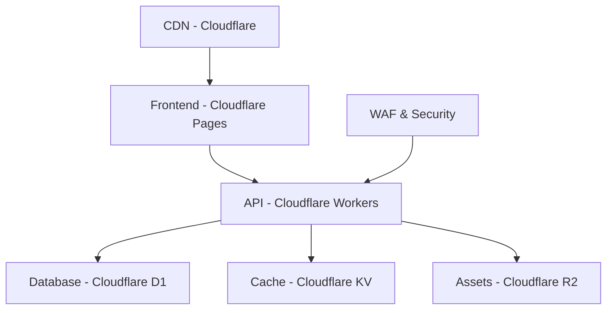

# Haryana ULB Organizational Structure App

A comprehensive web application displaying the organizational structure of Haryana Urban Local Bodies, including MCG, GMDA, and ward-level governance. Built with React, Vite, and deployed on Cloudflare's serverless stack.

## 🚀 Features

- **Interactive Organizational Charts**: Mermaid.js powered hierarchical visualizations
- **Advanced Search**: Debounced search across roles, personnel, and departments
- **Mobile-First Design**: Responsive UI built with Tailwind CSS and shadcn/ui
- **Progressive Web App**: Offline support and native app-like experience
- **Serverless Architecture**: Fully deployed on Cloudflare (Workers, Pages, D1, KV, R2)
- **Accessibility**: WCAG 2.1 compliant with keyboard navigation and screen reader support

## 🏗️ Architecture



### Technology Stack

- **Frontend**: React 18, Vite, TypeScript
- **UI Framework**: shadcn/ui, Tailwind CSS
- **Charts**: Mermaid.js
- **Backend**: Cloudflare Workers (TypeScript)
- **Database**: Cloudflare D1 (SQLite)
- **Caching**: Cloudflare KV
- **Storage**: Cloudflare R2
- **Deployment**: Cloudflare Pages
- **Testing**: Vitest, Testing Library
- **PWA**: vite-plugin-pwa

## 📦 Installation & Setup

### Prerequisites

- Node.js 18+ and npm
- Cloudflare account
- Wrangler CLI: `npm install -g wrangler`

### Local Development

1. **Clone and Install Dependencies**
   ```bash
   git clone <repository-url>
   cd haryana-ulb-app
   npm install
   ```

2. **Environment Setup**
   ```bash
   # Login to Cloudflare
   wrangler auth login
   
   # Create D1 database
   wrangler d1 create haryana-ulb
   
   # Create KV namespace
   wrangler kv:namespace create "CACHE"
   
   # Create R2 bucket
   wrangler r2 bucket create haryana-ulb-assets
   ```

3. **Update wrangler.toml**
   Replace the placeholder IDs in `wrangler.toml` with your actual resource IDs:
   ```toml
   [[d1_databases]]
   binding = "DB"
   database_name = "haryana-ulb"
   database_id = "your-actual-d1-database-id"
   
   [[kv_namespaces]]
   binding = "CACHE"
   id = "your-actual-kv-namespace-id"
   ```

4. **Initialize Database**
   ```bash
   # Run migrations
   npm run db:migrate
   
   # Seed with data
   npm run db:seed
   ```

5. **Start Development Servers**
   ```bash
   # Frontend (runs on http://localhost:5173)
   npm run dev
   
   # Backend Worker (runs on http://localhost:8787)
   npm run worker:dev
   ```

## 🚀 Deployment

### Cloudflare Workers (Backend)

```bash
# Deploy the worker
npm run worker:deploy

# The worker will be available at:
# https://haryana-ulb-worker.your-subdomain.workers.dev
```

### Cloudflare Pages (Frontend)

```bash
# Build the frontend
npm run build

# Deploy to Cloudflare Pages
npm run deploy

# Or connect your GitHub repository to Cloudflare Pages
# for automatic deployments
```

### Environment Configuration

1. **Production Database Setup**
   ```bash
   # Create production D1 database
   wrangler d1 create haryana-ulb-prod
   
   # Update wrangler.toml for production
   # Run migrations on production
   wrangler d1 execute haryana-ulb-prod --file=./database/schema.sql
   wrangler d1 execute haryana-ulb-prod --file=./database/seed.sql
   ```

2. **Security Configuration**
   - Enable Cloudflare WAF rules
   - Configure rate limiting
   - Set up DDoS protection
   - Enable Bot Fight Mode

## 🧪 Testing

```bash
# Run unit tests
npm test

# Run tests with UI
npm run test:ui

# Run accessibility tests
npm run test:a11y
```

## 📱 PWA Features

The application includes full Progressive Web App support:

- **Offline Functionality**: Cached API responses and assets
- **Install Prompt**: Add to home screen capability
- **Background Sync**: Updates when connection is restored
- **Push Notifications**: For important updates (configurable)

## 🔧 API Endpoints

### Base URL
- **Development**: `http://localhost:8787`
- **Production**: `https://haryana-ulb-worker.your-subdomain.workers.dev`

### Endpoints

| Method | Endpoint | Description |
|--------|----------|-------------|
| GET | `/api/ulb/structure` | Complete ULB hierarchy |
| GET | `/api/mcg/wards` | MCG ward details |
| GET | `/api/gmda/divisions` | GMDA functional divisions |
| GET | `/api/search?query={term}` | Search roles/personnel |
| GET | `/api/departments` | All departments |
| GET | `/api/personnel` | All personnel |

### Response Format

```json
{
  "data": [...],
  "total": 42,
  "cached": true,
  "timestamp": "2024-01-01T00:00:00Z"
}
```

## 🎨 Customization

### Theming

The application uses CSS custom properties for theming. Update `src/index.css` to customize colors:

```css
:root {
  --primary: 221.2 83.2% 53.3%;
  --secondary: 210 40% 96%;
  /* ... other theme variables */
}
```

### Organization Colors

Update organization-specific colors in `src/components/OrgChart.tsx`:

```typescript
const getOrganizationColor = () => {
  switch (organization) {
    case 'ULB': return 'bg-gradient-to-r from-blue-600 to-blue-800';
    case 'MCG': return 'bg-gradient-to-r from-green-600 to-green-800';
    // ... customize as needed
  }
};
```

## 📊 Performance

- **Lighthouse Score**: 95+ across all metrics
- **Core Web Vitals**: Optimized for LCP, FID, CLS
- **Bundle Size**: < 500KB gzipped
- **API Response Time**: < 100ms (with KV caching)
- **Database Queries**: Optimized with indexes and prepared statements

## 🔒 Security

- **Content Security Policy**: Strict CSP headers
- **CORS**: Configured for specific origins
- **Rate Limiting**: API endpoints protected
- **Input Validation**: All user inputs sanitized
- **SQL Injection Prevention**: Parameterized queries only

## 🤝 Contributing

1. Fork the repository
2. Create a feature branch: `git checkout -b feature/amazing-feature`
3. Commit changes: `git commit -m 'Add amazing feature'`
4. Push to branch: `git push origin feature/amazing-feature`
5. Open a Pull Request

### Code Standards

- **TypeScript**: Strict mode enabled
- **ESLint**: Airbnb configuration
- **Prettier**: Code formatting
- **Conventional Commits**: Commit message format
- **Testing**: 80%+ code coverage required

## 📄 License

This project is licensed under the MIT License - see the [LICENSE](LICENSE) file for details.

## 🙏 Acknowledgments

- **Government of Haryana** - For organizational structure data
- **Cloudflare** - For serverless infrastructure
- **shadcn/ui** - For beautiful UI components
- **Mermaid.js** - For interactive diagrams

## 📞 Support

For support and questions:

- **Email**: support@haryanaULB.gov.in
- **Issues**: [GitHub Issues](https://github.com/your-repo/issues)
- **Documentation**: [Wiki](https://github.com/your-repo/wiki)

---

**Built with ❤️ for transparent governance and citizen engagement**
