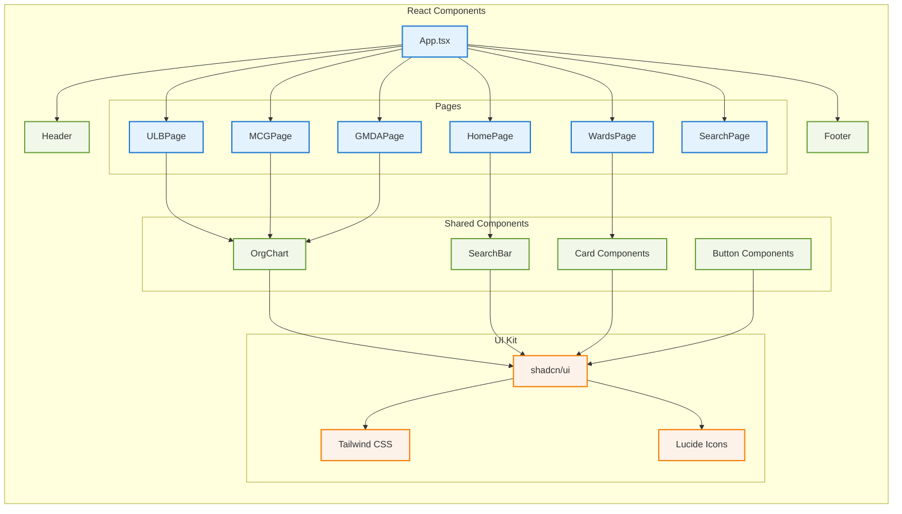
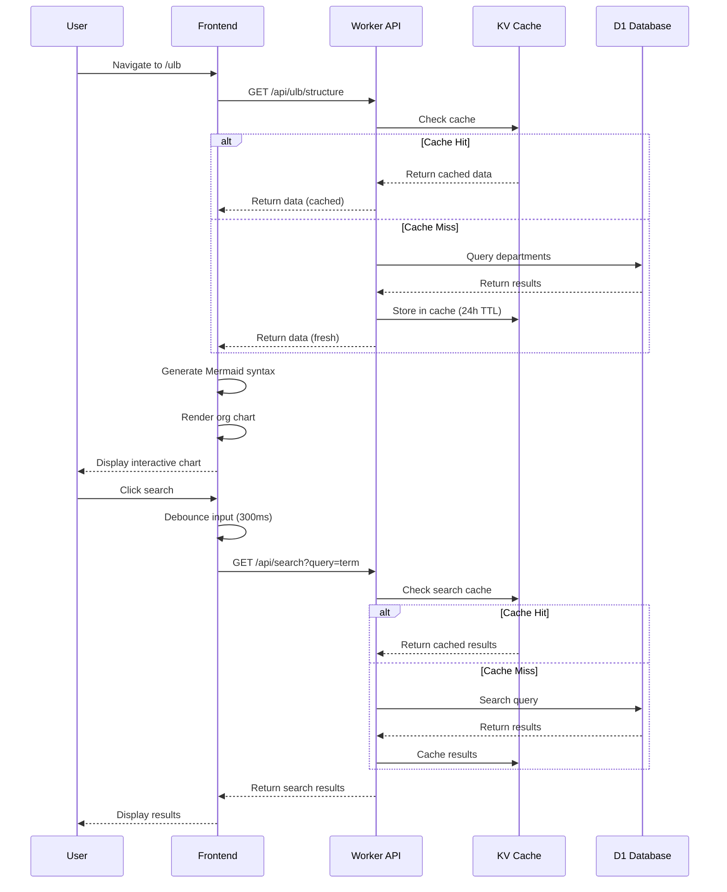
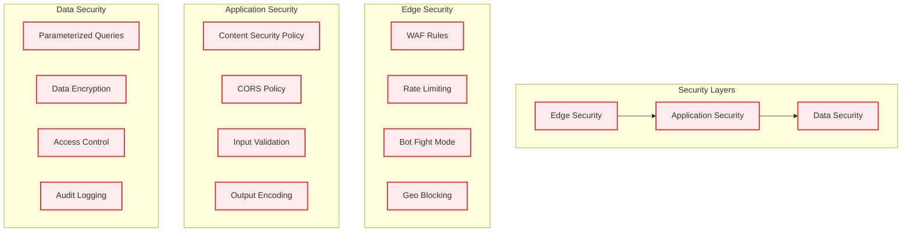
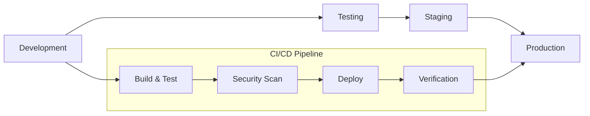

# Haryana ULB App Architecture

## System Overview

The Haryana ULB application is built on Cloudflare's serverless stack, providing a scalable, secure, and performant solution for displaying organizational structures.

## Architecture Diagram

```mermaid
graph TB
    subgraph "User Layer"
        U1[Mobile Users]
        U2[Desktop Users]
        U3[Tablet Users]
    end

    subgraph "CDN & Security"
        CF[Cloudflare CDN]
        WAF[Web Application Firewall]
        DDoS[DDoS Protection]
        SSL[SSL/TLS Termination]
    end

    subgraph "Frontend - Cloudflare Pages"
        SPA[React SPA]
        PWA[PWA Service Worker]
        Cache[Browser Cache]
        
        subgraph "UI Components"
            OC[Org Charts - Mermaid.js]
            SB[Search Bar]
            NAV[Navigation]
            CARDS[Info Cards]
        end
    end

    subgraph "Backend - Cloudflare Workers"
        API[API Routes]
        AUTH[Authentication]
        RATE[Rate Limiting]
        CORS[CORS Handling]
        
        subgraph "API Endpoints"
            ULB_API[/api/ulb/structure]
            MCG_API[/api/mcg/wards]
            GMDA_API[/api/gmda/divisions]
            SEARCH_API[/api/search]
        end
    end

    subgraph "Data Layer"
        D1[(Cloudflare D1 Database)]
        KV[(Cloudflare KV Cache)]
        R2[(Cloudflare R2 Storage)]
        
        subgraph "Database Tables"
            DEPT[departments]
            ROLES[roles]
            PERSONNEL[personnel]
            WARDS[wards]
        end
    end

    subgraph "External Integrations"
        GOVT[Government APIs]
        ANALYTICS[Analytics]
        MONITORING[Monitoring]
    end

    %% User connections
    U1 --> CF
    U2 --> CF
    U3 --> CF

    %% Security layer
    CF --> WAF
    WAF --> DDoS
    DDoS --> SSL
    SSL --> SPA

    %% Frontend connections
    SPA --> OC
    SPA --> SB
    SPA --> NAV
    SPA --> CARDS
    PWA --> Cache

    %% API connections
    SPA --> API
    API --> ULB_API
    API --> MCG_API
    API --> GMDA_API
    API --> SEARCH_API

    %% Backend to data
    API --> D1
    API --> KV
    API --> R2
    D1 --> DEPT
    D1 --> ROLES
    D1 --> PERSONNEL
    D1 --> WARDS

    %% External connections
    API --> GOVT
    SPA --> ANALYTICS
    API --> MONITORING

    %% Styling
    classDef userClass fill:#e1f5fe,stroke:#01579b,stroke-width:2px
    classDef securityClass fill:#fff3e0,stroke:#e65100,stroke-width:2px
    classDef frontendClass fill:#e8f5e8,stroke:#2e7d32,stroke-width:2px
    classDef backendClass fill:#f3e5f5,stroke:#7b1fa2,stroke-width:2px
    classDef dataClass fill:#fff8e1,stroke:#f57f17,stroke-width:2px
    classDef externalClass fill:#fce4ec,stroke:#c2185b,stroke-width:2px

    class U1,U2,U3 userClass
    class CF,WAF,DDoS,SSL securityClass
    class SPA,PWA,Cache,OC,SB,NAV,CARDS frontendClass
    class API,AUTH,RATE,CORS,ULB_API,MCG_API,GMDA_API,SEARCH_API backendClass
    class D1,KV,R2,DEPT,ROLES,PERSONNEL,WARDS dataClass
    class GOVT,ANALYTICS,MONITORING externalClass
```

## Component Architecture



## Data Flow



## Security Architecture



## Performance Optimization

### Frontend Optimizations
- **Code Splitting**: Route-based lazy loading
- **Bundle Optimization**: Tree shaking and minification
- **Image Optimization**: WebP format with fallbacks
- **Caching Strategy**: Aggressive caching with cache busting
- **PWA**: Service worker for offline functionality

### Backend Optimizations
- **Database Indexing**: Optimized queries with proper indexes
- **KV Caching**: 24-hour TTL for frequently accessed data
- **Connection Pooling**: Efficient database connections
- **Response Compression**: Gzip compression for API responses

### Cloudflare Optimizations
- **Global CDN**: Edge caching across 200+ locations
- **Argo Smart Routing**: Intelligent traffic routing
- **Polish**: Automatic image optimization
- **Rocket Loader**: JavaScript optimization
- **Auto Minify**: CSS, JS, and HTML minification

## Scalability Considerations

### Horizontal Scaling
- **Serverless Architecture**: Auto-scaling Workers
- **Edge Computing**: Distributed processing
- **Multi-Region**: Global deployment capability

### Vertical Scaling
- **Database Sharding**: Partition large datasets
- **Read Replicas**: Distribute read operations
- **Caching Layers**: Multiple cache levels

### Performance Monitoring
- **Real User Monitoring**: Core Web Vitals tracking
- **Synthetic Monitoring**: Automated performance tests
- **Error Tracking**: Comprehensive error reporting
- **Analytics**: User behavior and performance insights

## Deployment Pipeline



This architecture ensures high availability, security, and performance while maintaining cost-effectiveness through Cloudflare's serverless platform.
